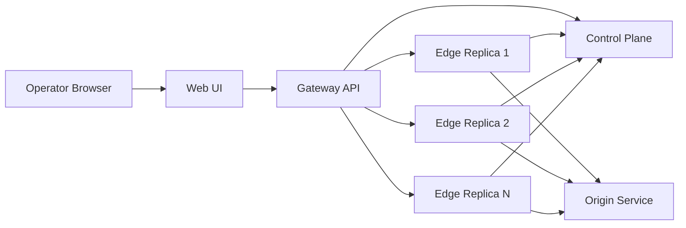
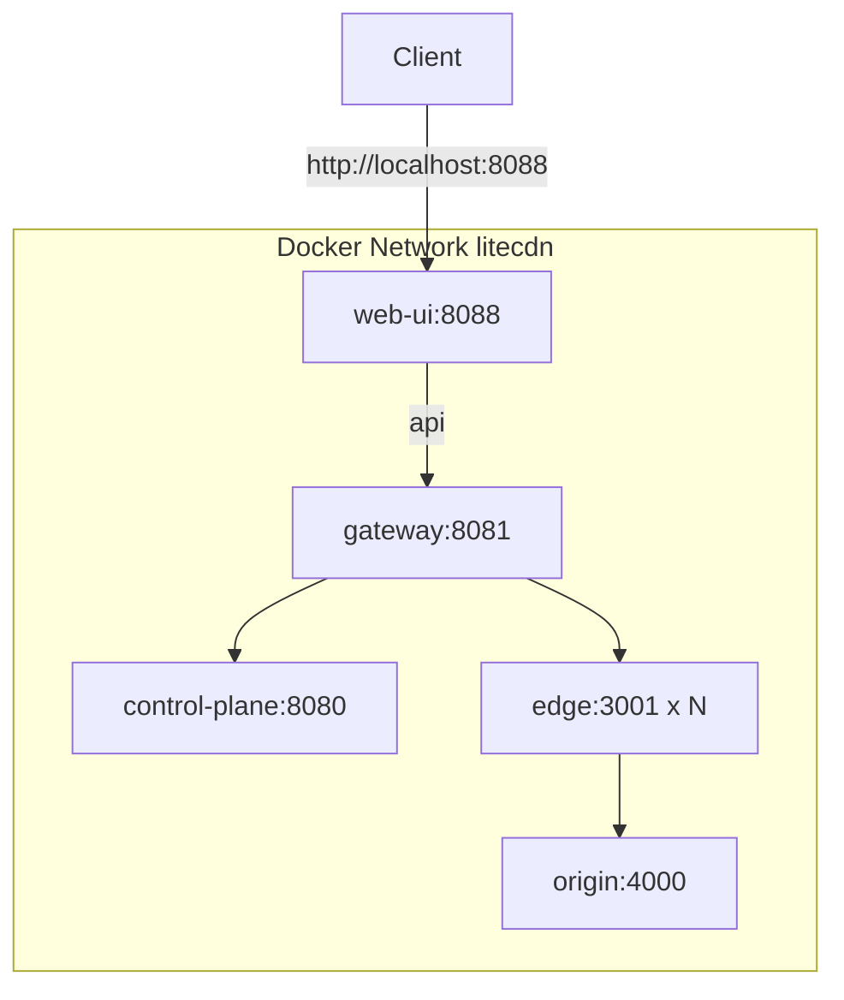

# LiteCDN Production Demo Architecture

## 1. Current Codebase Analysis

### Existing Architecture Summary
- Single repository mixing simulation and dashboard concerns.
- `backend/origin/origin.js`: origin static/file API.
- `backend/edge/edge.js`: edge cache + origin pull.
- `backend/cdn/cdn.js`: gateway routing + static UI hosting.
- Routing and cache logic tightly coupled and only partially productionized.

### Observed Bottlenecks and Gaps
- Environment portability issue (`set VAR=...` scripts are Windows-oriented).
- Gateway and UI bundled; no clean service boundaries.
- Edge cache size logic mixes entry count and bytes inconsistently.
- Metrics polling at 50ms is overly aggressive and can skew behavior.
- No robust service discovery for dynamic edge count.
- Limited operational controls for demo operators.

## 2. Refactored Production Architecture

### Service Responsibilities
- **Control Plane**: topology registry, origin configuration, edge lifecycle state.
- **Origin Service**: authoritative content store, upload/list/delete APIs.
- **Edge Service (N replicas)**: segmented cache engine, miss fetch, heartbeat metrics.
- **Gateway Service**: alpha-beta-epsilon routing, policy control, traffic telemetry, flow logging.
- **Web UI**: operator dashboard for runtime management and visualization.

### Logical Diagram

### Deployment Diagram

## 3. Cache and Routing Strategy

### Cache Management
- Policy fixed to `SEGMENTED`.
- Segments are `fresh` (35%), `popular` (60%), and `missAware` (5%).
- Configurable `maxEntries` and `ttlMs`.
- Runtime parameter update propagated to all active edges.
- Purge endpoint for deterministic demos.

### Routing Strategy
- Strategy fixed to `ALPHA_BETA_EPSILON`.
- Selection score uses latency and active load with epsilon exploration.

Gateway scoring:

$$
	ext{score} = \alpha\cdot\text{latency} + \beta\cdot\text{load}\cdot 80
$$

Selection behavior:
- With probability $1-\epsilon$, choose the lowest-score edge.
- With probability $\epsilon$, explore a non-best healthy edge.

## 4. Observability
- Gateway telemetry: total requests, cache hit/miss counters, strategy usage, recent flow events.
- Edge telemetry: in-flight requests, rolling latency, cache snapshot stats.
- Control-plane topology API shows active, down, and disabled nodes.
